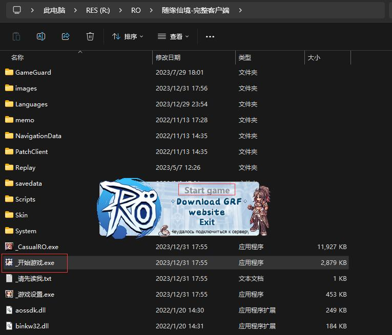
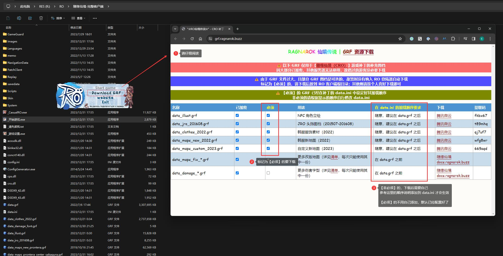
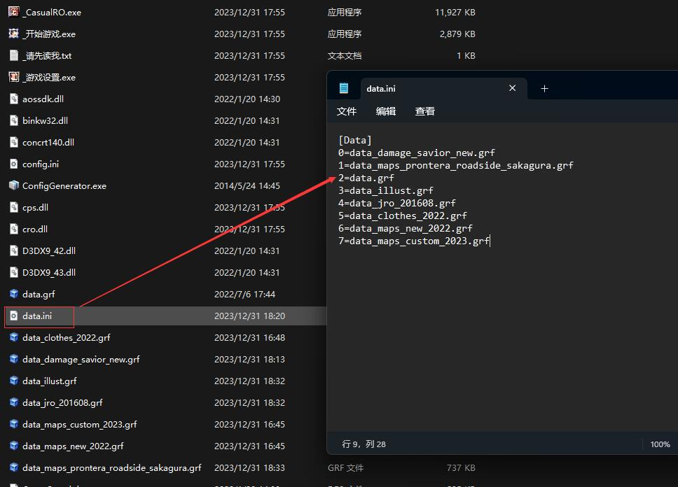

# cro-patch-grf

> 随缘仙境补丁 - GRF 资源（已加密）

------

## GRF 使用方法

运行登陆器 `_开始游戏.exe` 时，会自动更新游戏补丁：

> 在安装补丁完成之前，【Start Game】按钮是灰色的

但是 GRF 图档文件过大，不会自动下载，需要手工点击 `Download GRF` 按钮。

点击后会自动触发访问 https://grf.ragnarok.buzz/ ，这个站点提供了 GRF 资源下载：

一般情况下，只需要关注两列：

- 标记为【必须】的 GRF 都需要下载到 RO 客户端的根目录
- 标记为【非必须】的 GRF 看个人需求下载，但是下载后需要根据【加载顺序】手动修改 data.ini 才能生效

最后，点击登陆器面板上的【Start Game】按钮，进入仙境传说的世界吧 ~

